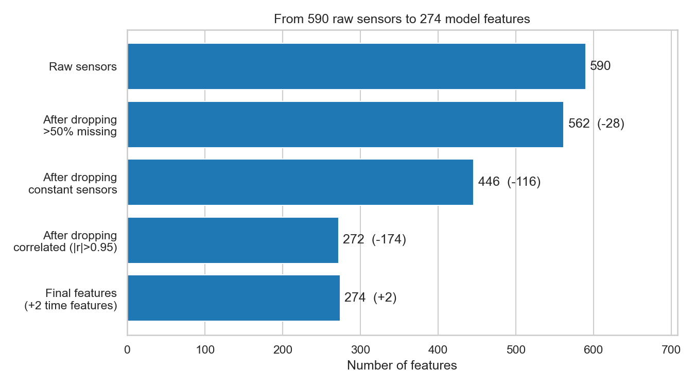
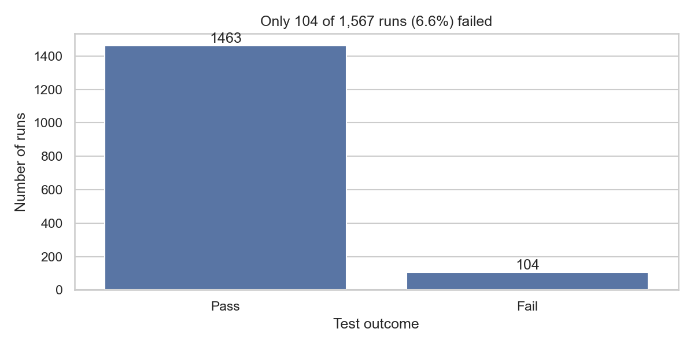
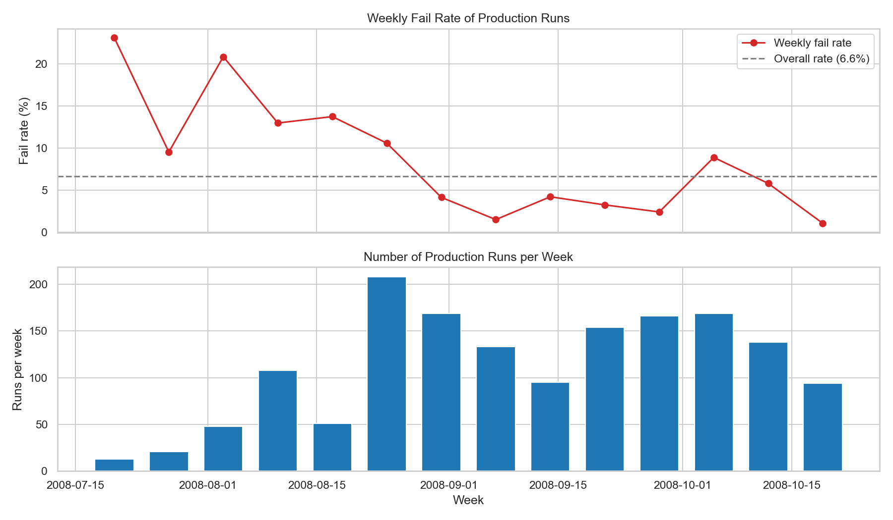
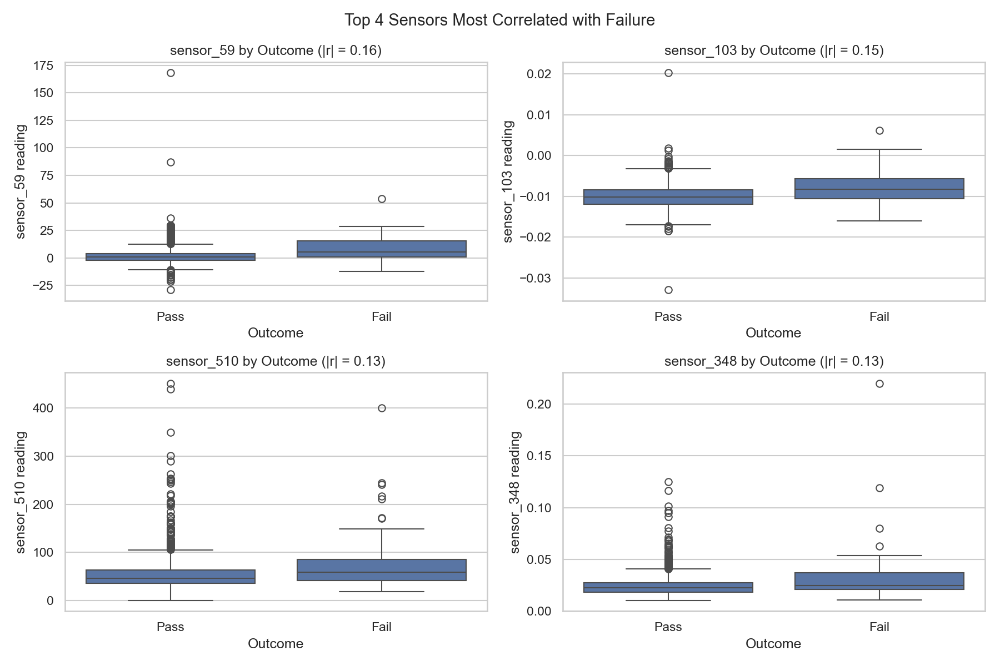
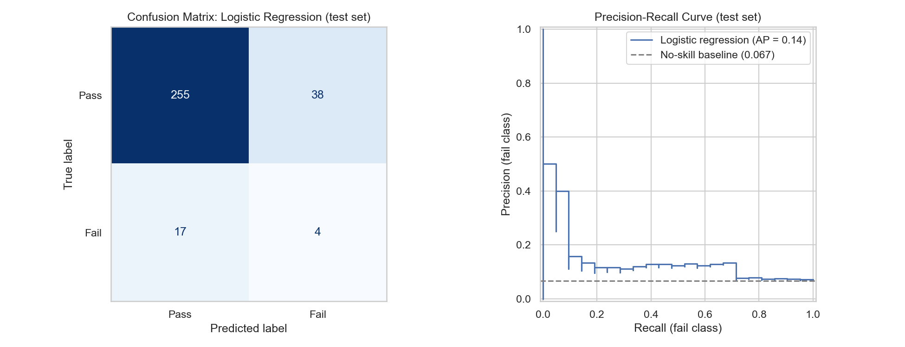

# Predicting Semiconductor Yield Failures from In-Line Process Sensors

**UC Berkeley Professional Certificate in Machine Learning & AI: Capstone Project (Part 1: Initial Report & EDA)**

## Problem statement

In semiconductor manufacturing, every wafer goes through hundreds of process steps while in-line sensors record hundreds of signals. Only a small share of production runs fail the final quality test, but a failure is usually found late, after more time and money have been spent on wafers that were already going bad. Engineers also find it hard to tell which of the hundreds of sensors actually warn of a coming failure.

**Research question:** Can in-line process sensor data predict whether a production run will fail quality testing, and which sensors are the strongest early indicators of failure?

**Goal:** a classification model that flags likely failing runs early (catching as many fails as possible while keeping false alarms manageable) and points engineers to the sensors that matter most.

> **Note on the project change:** my earlier problem statement (Modules 11 and 16) was a surrogate model built on company simulation data. Because of my employer's data policy I can't use that data in a public project, so I switched to the public SECOM dataset. The topic (using process data from semiconductor manufacturing to predict outcomes) stays the same, but the problem type changed from regression to classification.

## Notebook

[Main analysis notebook: `notebooks/secom_capstone.ipynb`](notebooks/secom_capstone.ipynb)

## Data

**Source:** McCann, M. & Johnston, A. (2008). SECOM [Dataset]. UCI Machine Learning Repository. https://archive.ics.uci.edu/dataset/179/secom

- 1,567 production runs from a real semiconductor fab (July–October 2008)
- 590 anonymized sensor signals per run
- A pass/fail label from in-house testing, plus a timestamp
- Only **104 runs (6.6%) failed**, so the classes are very imbalanced

## Methodology

1. **Loading and inspection:** combined the sensor file and the label file, checked data types, class balance, time range and missing values.
2. **Cleaning:** removed 28 sensors with more than 50% missing values and 116 sensors that never change (constant). No duplicate runs or sensors were found. The remaining missing values (~1.6%) are filled with the median inside the model pipeline, so this is learned from the training data only.
3. **Exploratory analysis:** class balance, fail rate over time, missing values per sensor, the sensors most related to failure (box plots and summary statistics), correlations between sensors, and an outlier analysis (1.5 × IQR rule).
4. **Feature engineering:** extracted hour and day of week from the timestamp, removed 174 sensors that were near copies of another sensor (correlation above 0.95), and used PCA to see how much the data can be compressed. Final input: **272 sensors + 2 time features = 274 features**.
5. **Baseline model:** stratified 80/20 train/test split, then a logistic regression (with class weights for the imbalance) in a pipeline of median imputation, scaling and model. It is compared against a "dummy" model that always predicts pass, and checked with 5-fold cross-validation.



### Evaluation metric

- **Primary metric: PR-AUC (average precision).** It measures how well the model ranks failing runs above passing runs. It focuses on the rare fail class, and it has a clear "no skill" reference: random guessing scores about the fail rate (~0.067).
- **Secondary metric: recall on the fail class**, the share of failing runs that are caught. A missed fail lets bad wafers continue through more steps, which costs much more than a false alarm.
- **Why not accuracy:** a model that always says "pass" is 93% accurate but catches zero fails.

## Results

### Key findings from the data

- **Failures are rare:** only 6.6% of runs fail. This makes the problem hard and makes accuracy a misleading measure.

  

- **The fail rate changed over time:** it was high in July and August (10–23% per week) and dropped to about 1–4% from September. This looks like a change in the process around the end of August (for example maintenance or a recipe change). It also means a model trained on older data may not fit newer production in the same way.

  

- **No single sensor predicts failure:** the most related sensors show only a weak link to failure (correlation of about 0.16 or less). Failing runs tend to have somewhat higher and more variable readings, but pass and fail overlap a lot. A useful model has to combine many weak signals.

  

- **Many sensors are redundant:** over half of the 590 sensors were either constant or almost an exact copy of another sensor.
- **Outliers are everywhere, and they were kept:** 1,566 of 1,567 runs have at least one unusual reading. In process data these are often real process excursions, which is exactly the kind of event that can cause a fail, so removing them could remove the signal.

### Baseline model performance

| Model | Accuracy | Recall (fail) | Precision (fail) | PR-AUC |
|---|---|---|---|---|
| Dummy (always predicts pass) | 0.933 | 0.00 | 0.00 | 0.067 |
| Logistic regression | 0.825 | 0.19 | 0.10 | **0.143** |

Cross-validation PR-AUC: 0.165 ± 0.081 (5 folds).



**What this means:**

- The model is **about 2 times better than random guessing** (PR-AUC 0.14 vs 0.067), so the sensors do carry real information about failures.
- On the test set it caught **4 of 21 failing runs** and raised **38 false alarms**, so an engineer would check about 9 good runs for every real fail found. **This baseline is not ready for production use**, but it shows that the approach can work.
- The model **overfits strongly** (PR-AUC 0.91 on training data vs 0.14 on new data). With 274 features and only 83 failing runs to learn from, it picks up noise. The results also vary a lot between cross-validation folds, because there are so few failures.

## Next steps and recommendations

For the final report (Module 24):

- **Reduce overfitting:** tune the regularization strength with GridSearchCV.
- **Try stronger models:** Random Forest, gradient boosting and SVM, which can capture weak and non-linear patterns.
- **Tune the alarm threshold:** choose the trade-off between caught fails and false alarms that the fab can accept.
- **Find the sensors that matter:** use permutation importance to give engineers a short list of sensors to monitor.
- **Test on future data:** use a time-based split (train on earlier runs, test on later ones) to check that the model works on new production, given the change in fail rate over time.

## Project structure

```
├── README.md
├── data/                          # SECOM raw files (UCI)
│   ├── secom.data                 # sensor readings
│   ├── secom_labels.data          # pass/fail label + timestamp
│   └── secom.names                # dataset description
├── notebooks/
│   └── secom_capstone.ipynb       # main analysis notebook
└── images/                        # figures used in this README
```
